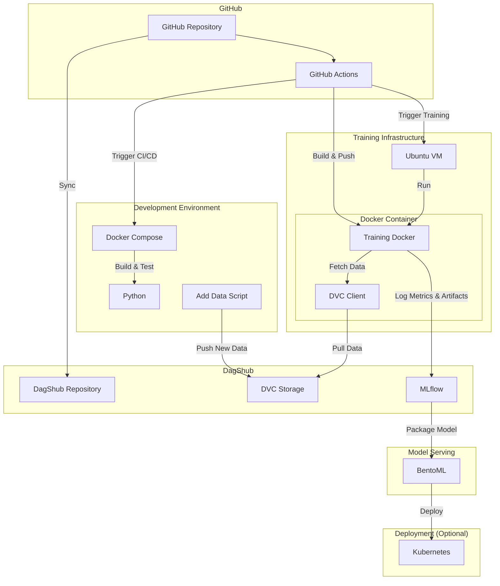

# mlops_archi_simple

Architecture simple d'un pipeline MLOps avec les éléments suivants :

```mermaid
graph TB
    subgraph "GitHub"
        GR[GitHub Repository]
        GA[GitHub Actions]
    end

    subgraph "DagShub"
        DS[DagShub Repository]
        DVC[DVC Storage]
        ML[MLflow]
    end

    subgraph "Development Environment"
        PY[Python]
        DC[Docker Compose]
        AD[Add Data Script]
    end

    subgraph "Training Infrastructure"
        VM[Ubuntu VM]
        subgraph "Docker Container"
            TRD[Training Docker]
            DVCc[DVC Client]
        end
    end

    subgraph "Model Serving"
        BML[BentoML]
    end

    subgraph "Deployment (Optional)"
        K8S[Kubernetes]
    end

    AD -->|Push New Data| DVC
    GR --> GA
    GA --> |Trigger CI/CD| DC
    DC --> |Build & Test| PY
    GR --> |Sync| DS
    GA --> |Build & Push| TRD
    GA --> |Trigger Training| VM
    VM --> |Run| TRD
    TRD --> |Fetch Data| DVCc
    DVCc --> |Pull Data| DVC
    TRD --> |Log Metrics & Artifacts| ML
    ML --> |Package Model| BML
    BML --> |Deploy| K8S
```