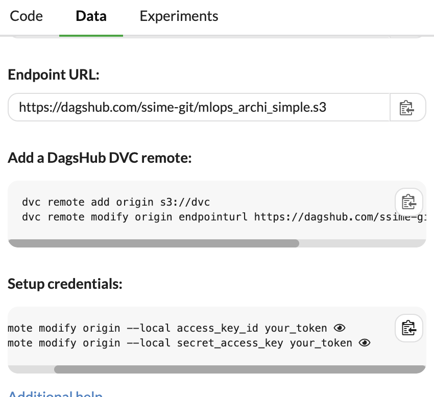

# Tutoriel MLOps pour débutants - Partie 1: Configuration initiale

Dans ce tutoriel, nous allons créer un projet MLOps complet en utilisant le jeu de données Iris, DVC, et DagShub. Cette première partie se concentre sur la configuration initiale du projet.

## Étape 1: Création du projet et de l'environnement virtuel

1. Créez un nouveau dossier pour votre projet et naviguez dedans:
   ```sh
   mkdir iris_mlops_project
   cd iris_mlops_project
   ```

   Créer un fichier requirements.txt avec les dépendances suivantes:
   ```txt
   numpy 
   pandas 
   scikit-learn 
   dvc[s3]
   mlflow 
   dagshub
   ```

2. Créez un environnement virtuel Python et activez-le:
   ```sh
   python3 -m venv venv
   source venv/bin/activate  # Sur Windows, utilisez `venv\Scripts\activate`
   ```

3. Mettez à jour pip et installez les dépendances de base:
   ```sh
   pip install --upgrade pip
   pip install -r requirements.txt
   ```

## Étape 2: Initialisation du dépôt Git et DVC

1. Initialisez un dépôt Git: (pas besoin de faire un git init si vous avez déjà un dépôt)
   ```sh
   git init
   ```

2. Créez un fichier `.gitignore`:
   ```sh
   echo "venv/" > .gitignore
   echo "*.pyc" >> .gitignore
   echo "__pycache__/" >> .gitignore
   ```

3. Initialisez DVC:

   From DVC, get the line with the token and the endpointurl:
   

   ```sh
   dvc remote add origin s3://dvc
   dvc remote modify origin endpointurl https://dagshub.com/ssime-git/mlops_archi_simple.s3
   dvc remote modify origin --local access_key_id your_token
   dvc remote modify origin --local secret_access_key your_token
   ```

## Étape 3: Configuration de DagShub

1. Allez sur [DagShub](https://dagshub.com/) et créez un compte si vous n'en avez pas déjà un.

2. Créez un nouveau dépôt sur DagShub nommé "iris_mlops_project".

3. Suivez les instructions sur DagShub pour connecter votre dépôt local à DagShub. Cela impliquera généralement d'ajouter DagShub comme remote Git et DVC:
   ```
   git remote add origin https://dagshub.com/ssime-git/mlops_archi_simple.git # optionnel si vous avez déjà un dépôt git
   dvc remote add origin https://dagshub.com/ssime-git/mlops_archi_simple.dvc
   ```

## Étape 4: Création de la structure de dossiers

Créez la structure de dossiers suivante:

```sh
mkdir -p data/raw data/processed src/data src/models src/utils tests configs
```

## Étape 5: Premier commit et push

1. Ajoutez tous les fichiers à Git:
   ```sh
   git add .
   ```

2. Faites votre premier commit:
   ```sh
   git commit -m "Initial project setup"
   ```

3. Poussez vos changements vers DagShub:
   ```sh
   git push -u origin main
   ```

Félicitations! Vous avez maintenant configuré la base de votre projet MLOps. Dans la prochaine partie, nous allons nous concentrer sur l'ajout et le prétraitement des données Iris.